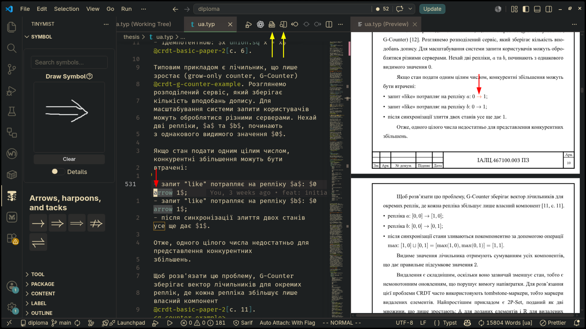

# Шаблон дипломного проєкту для Typst

Шаблон дипломного проєкту для Typst, орієнтований на структуру документів КПІ
ФІОТ, кафедра ОТ. Шаблон пройшов перевірку нормоконтролю у 2026 р.

> [!IMPORTANT]
> Шаблон не є офіційним шаблоном КПІ або ФІОТ.

## Рекомендовані плагіни та інструменти

- [Typst](https://typst.app/docs/). Перевірена версія `0.14.2`
- [Tinymist](https://github.com/Myriad-Dreamin/tinymist) для підтримки в
  редакторі
- [Scripts](https://github.com/erotourtes/mirage#scripts) з проєкту `mirage` для
  допоміжних задач

Приклад workflow: 

## Швидкий старт

Скопіюйте файл `ua.typ` з
[репозиторія mirage](https://github.com/erotourtes/mirage/blob/main/thesis/ua.typ).

Документ використовує відносні шляхи, тому для компіляції потрібно або
перейменувати імпорти в `ua.typ`, або дотримуватися такої структури:

```text
thesis/
├── ua.typ
└── templates/
    └── kpi-fice-ot-typst-thesis-template/
```

Команда для налаштування нового проєкту з шаблону (її потрібно запускати з
кореня git-репозиторію в
[fish shell](https://github.com/fish-shell/fish-shell)):

```fish
mkdir thesis
and cd thesis
and git submodule add https://github.com/erotourtes/kpi-fice-ot-typst-thesis-template.git templates/kpi-fice-ot-typst-thesis-template
and curl -L https://raw.githubusercontent.com/erotourtes/mirage/main/thesis/ua.typ -o ua.typ
```

Збірка документа:

```bash
typst compile ua.typ diploma.pdf
```

> [!NOTE]
> Збірка може завершитися помилкою, якщо `ua.typ` посилається на файли,
> які є тільки в репозиторії [mirage](https://github.com/erotourtes/mirage). Для
> повної збірки прикладу без змін `ua.typ` склонуйте mirage і виконайте
> `cd thesis typst compile ./ua.typ ./ua.pdf --root ../`.
>
> Альтернативний варіант — відредагувати ua.typ, прибравши або замінивши
> елементи, яких немає у вашому новому репозиторії.

## Обмеження

- Footer у Typst (0.14.2) може резервувати тільки фіксовану висоту. Через це
  шаблон резервує висоту найбільшого штампа, тому зміст і додатки можуть мати
  додатковий нижній відступ на сторінках із меншим штампом.
- Шаблон не перевіряє автоматично всі правила оформлення. Зокрема, потрібно
  вручну стежити за такими вимогами:
  - висячі рисунки заборонені;
  - якщо таблиця не вміщується на сторінку, її потрібно розбити, наприклад за
    допомогою `continued_table`;
  - `Опис альбому` та `Анотація` повинні займати рівно одну сторінку;
  - перше посилання на елемент, наприклад рисунок або таблицю, повинне бути
    розміщене до самого елемента або на тій самій сторінці.

## Корисні функції

`lib/template.typ` експортує допоміжні функції для посилань і оформлення:

- `fig_ref` — посилання на рисунок;
- `table_ref` — посилання на таблицю;
- `code_ref` — посилання на лістинг коду;
- `code_listing` — оформлення лістингу як рисунка;
- `continued_table` — таблиця з продовженням на кількох сторінках;
- `todo` — помітка для незавершеного фрагмента.

## Ліцензія

Проєкт поширюється за умовами [LICENSE](./LICENSE).
