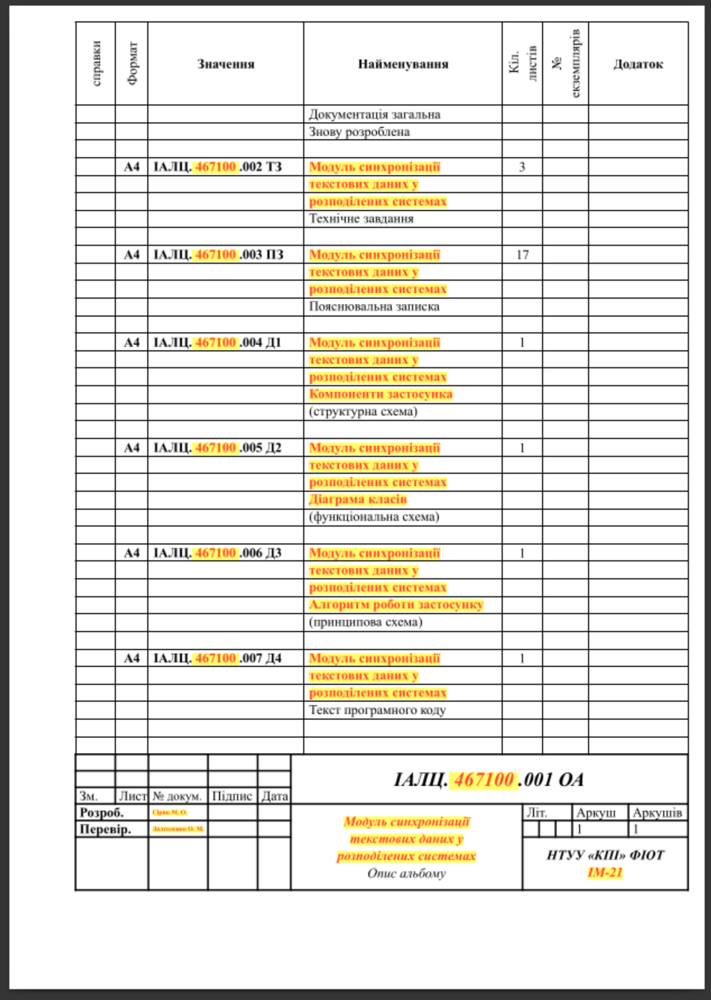

# Шаблон дипломного проєкту для Typst

Шаблон дипломного проєкту для Typst, орієнтований на структуру документів КПІ
ФІОТ, кафедра ОТ. Шаблон пройшов перевірку нормоконтролю у 2026 р.

> [!IMPORTANT]
> Шаблон не є офіційним шаблоном КПІ або ФІОТ. Також
> [існує версія для LaTeX](https://github.com/bsc-diploma/LaTex-bachelors-thesis)

## Рекомендовані плагіни та інструменти

- [Typst](https://typst.app/docs/). Перевірена версія `0.14.2`
- [Tinymist](https://github.com/Myriad-Dreamin/tinymist) для підтримки в
  редакторі
- [Scripts](https://github.com/erotourtes/mirage#scripts) з проєкту `mirage` для
  допоміжних задач
- [Drawio](https://www.drawio.com/) для побудови діаграм, які можна експортувати
  в `pdf` та нативно імпортувати в `typst` зі збереженням виділення елементів.

Приклад workflow: 

## Швидкий старт

У репозиторії є готовий приклад документа: [`example/ua.typ`](./example/ua.typ).
Він показує структуру роботи, і виділяє інформацію, яку потрібно замінити.


Збірка документа:

```bash
typst compile ./example/ua.typ diploma.pdf --root .
```

## Приклад готової роботи

[Репозиторій mirage](https://github.com/erotourtes/mirage/blob/main/thesis/ua.typ)
є повною бакалаврською роботою, яка використовувала цей шаблон.

Скомпільована версія доступна за посиланням
https://github.com/erotourtes/mirage/releases/download/v1.0.0/thesis.tar.xz

## Обмеження

- Footer у Typst (0.14.2) може резервувати тільки фіксовану висоту. Через це
  шаблон резервує висоту найбільшого штампа, тому зміст і додатки можуть мати
  додатковий нижній відступ на сторінках із меншим штампом.
- Шаблон не перевіряє автоматично всі правила оформлення. Зокрема, потрібно
  вручну стежити за такими вимогами:
  - висячі рисунки заборонені;
  - якщо таблиця не вміщується на сторінку, її потрібно розбити, наприклад за
    допомогою `continued_table`;
  - `Опис альбому` та `Анотація` повинні займати рівно одну сторінку;
  - перше посилання на елемент, наприклад рисунок або таблицю, повинне бути
    розміщене до самого елемента або на тій самій сторінці;
  - обсяг пояснювальної записки має становити щонайменше 55 сторінок;
  - перший розділ не може перевищувати 20 % обсягу пояснювальної записки.
  - якщо в назві рисунка є слова «схема-алгоритму» або «схема», рисунок має
    відповідати ГОСТу. Можна робити рисунки в довільному графічному стилі, якщо
    в назві рисунка написати «послідовність дій», «етапи виконання» і т. ін;
  - розділ повинен мати принаймні 2 рядки тексту на одній сторінці, інакше він
    повинен бути перенесеним на наступну сторінку.
- Посилання на відео у списку джерел у форматі `"gost-r-705-2008-numeric"`
  відображає лише назву без додаткових даних (посилання тощо).
- Горизонтальні діаграми в додатках мають інші вимоги, ніж вертикальні, тому
  шаблон підтримує тільки вертикальні діаграми.

## Корисні функції

`lib/template.typ` експортує допоміжні функції для посилань і оформлення:

- `fig_ref` — посилання на рисунок;
- `table_ref` — посилання на таблицю;
- `code_ref` — посилання на лістинг коду;
- `code_listing` — оформлення лістингу як рисунка;
- `continued_table` — таблиця з продовженням на кількох сторінках;
- `un_link` — підкреслене посилання;
- `todo` — помітка для незавершеного фрагмента.

## AI

[AGENTS.md](./AGENTS.md) має інструкції для написання розділів.

## Ліцензія

Проєкт поширюється за умовами [LICENSE](./LICENSE).

---

Відформатовано `uvx mdformat --wrap 80 README.md`
